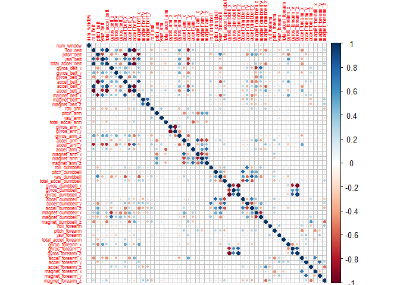
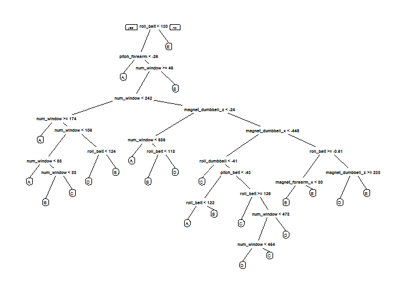

# Introduction

The goal of this project is to use data collected from accelerometers on the belt, forearm, arm, and dumbell of 6 participants to predict the manner in which praticipants did the exercise. This is indicated by the "classe" variable in the training set, which is a factor variable with 5 levels: A, B, C, D and E.

The large dataset contains many rows and columns and any variables beside "classe" can be used to build the prediction model. 5-fold cross validation random forest is chosen as the machine learning method because of its high accuracy. Interpretability is not important since the main focus is on correct prediction. The machine learning algorithm is then applied to the 20 test cases available in the test data.  

# Background 

Using devices such as Jawbone Up, Nike FuelBand, and Fitbit it is now possible to collect a large amount of data about personal activity relatively inexpensively. These type of devices are part of the quantified self movement - a group of enthusiasts who take measurements about themselves regularly to improve their health, to find patterns in their behavior, or because they are tech geeks. One thing that people regularly do is quantify how much of a particular activity they do, but they rarely quantify how well they do it. In this project, your goal will be to use data from accelerometers on the belt, forearm, arm, and dumbell of 6 participants. They were asked to perform barbell lifts correctly and incorrectly in 5 different ways. More information is available from the website here: http://web.archive.org/web/20161224072740/http:/groupware.les.inf.puc-rio.br/har (see the section on the Weight Lifting Exercise Dataset).

# Data Processing 

## Data Source

The training data for this project are available here:

https://d396qusza40orc.cloudfront.net/predmachlearn/pml-training.csv

The test data are available here:

https://d396qusza40orc.cloudfront.net/predmachlearn/pml-testing.csv

## Data Cleaning

Loading caret and other necessary libraries.

```r
library(caret)
library(corrplot)
library(rpart.plot)
```

Reading raw data from downloaded files, both training and testing set.

```r
rawTrain <- read.csv("pml-training.csv", na.strings = c("","NA"))
rawTest <- read.csv("pml-testing.csv", na.strings = c("","NA"))
```

The raw data in training set contains 19622 rows and 160 columns, in which "classe" is one of them. The number of each class is shown below.  

```r
dim(rawTrain)
```

```
## [1] 19622   160
```

```r
table(rawTrain$classe)
```

```
## 
##    A    B    C    D    E 
## 5580 3797 3422 3216 3607
```

The first 5 columns indicates row number ("X"), user name and timestamps. They are not meaningful for prediction and can be removed from the data sets. 

```r
names(rawTrain)[1:5]
```

```
## [1] "X"                    "user_name"            "raw_timestamp_part_1"
## [4] "raw_timestamp_part_2" "cvtd_timestamp"
```

```r
TrainSet <- rawTrain[,-(1:5)]
TestSet <- rawTest[,-(1:5)]
```

Checking for missing values, it can be seen that 55 columns have no missing values and 100 columns contain mostly missing values (up to 98%). Therefore, these 100 columns should be deleted from the data sets. Near zero variance predictors should also be identified and deleted. Final training data set contains 19622 rows and 54 columns. 

```r
table(colSums(is.na(TrainSet)))
```

```
## 
##     0 19216 
##    55   100
```

```r
TrainSet <- TrainSet[,colSums(is.na(TrainSet))==0]
TestSet <- TestSet[,colSums(is.na(TrainSet))==0]
```


```r
zeroVar <- nearZeroVar(TrainSet)
TrainSet <- TrainSet[,-zeroVar]
TestSet <- TestSet[, -zeroVar]
dim(TrainSet)
```

```
## [1] 19622    54
```

## Data Partition

Data in the training set is splitted into training (used to build model) and validating with ratio 0.7/0.3.

```r
set.seed(123)
inTrain <- createDataPartition(TrainSet$classe, p = 0.7, list = F)
training <- TrainSet[inTrain, ]
validate <- TrainSet[-inTrain, ]
```

A graphical plot displays the correlation matrix of different variables in the training set

```r
corrplot(cor(training[, -54]), tl.cex = 0.5)
```

<!-- -->

# Machine Learning & Prediction

## Decision Tree

Constructing a predictive model for activity recognition using Decision Tree algorithm provided by method "rpart2" in caret package. The tree model is shown in the figure. 

```r
DecisionTree <- train(classe~., data = training, method = "rpart2")
prp(DecisionTree$finalModel)
```

<!-- -->

To estimate the performance of the decision tree model, apply it to predict "classe" in the validation set. Out-of-sample accuracy is 0.7998 and kappa is 0.7475. 

```r
TreePred <- predict(DecisionTree, validate)
confusionMatrix(validate$classe, TreePred)
```

```
## Confusion Matrix and Statistics
## 
##           Reference
## Prediction    A    B    C    D    E
##          A 1496   45    0  114   19
##          B  114  788   57  127   53
##          C    3   55  771  195    2
##          D   18   68   37  787   54
##          E    7   42    3  165  865
## 
## Overall Statistics
##                                         
##                Accuracy : 0.7998        
##                  95% CI : (0.7894, 0.81)
##     No Information Rate : 0.2783        
##     P-Value [Acc > NIR] : < 2.2e-16     
##                                         
##                   Kappa : 0.7475        
##  Mcnemar's Test P-Value : < 2.2e-16     
## 
## Statistics by Class:
## 
##                      Class: A Class: B Class: C Class: D Class: E
## Sensitivity            0.9133   0.7896   0.8882   0.5670   0.8711
## Specificity            0.9581   0.9282   0.9492   0.9606   0.9556
## Pos Pred Value         0.8937   0.6918   0.7515   0.8164   0.7994
## Neg Pred Value         0.9663   0.9558   0.9800   0.8779   0.9733
## Prevalence             0.2783   0.1696   0.1475   0.2359   0.1687
## Detection Rate         0.2542   0.1339   0.1310   0.1337   0.1470
## Detection Prevalence   0.2845   0.1935   0.1743   0.1638   0.1839
## Balanced Accuracy      0.9357   0.8589   0.9187   0.7638   0.9134
```

## Random Forest

Random forest is a machine learning method that constructs a multiple of decision trees at training time. The forest prediction is obtained by taking the most common class or the mean-value tree predictions. Hence, it is expected to have a better predicting power than a single decision tree. 

Building a predictive model using random forest algorithm with 5-fold cross validation, provided by "rf" method in caret package.  

```r
RdForest <- train(classe~., data = training, method = "rf", trControl=trainControl(method = "cv", number = 5))
```

```
## randomForest 4.6-12
```

```
## Type rfNews() to see new features/changes/bug fixes.
```

```
## 
## Attaching package: 'randomForest'
```

```
## The following object is masked from 'package:ggplot2':
## 
##     margin
```

Applying the random forest model to predict "classe" in the validation set and examine the performance of the model. Out-of-sample accuracy is  0.9981 and kappa is 0.9976. The predictive power is greatly improved compared to the single decision tree model.

```r
RFpred <- predict(RdForest, validate)
confusionMatrix(validate$classe, RFpred)
```

```
## Confusion Matrix and Statistics
## 
##           Reference
## Prediction    A    B    C    D    E
##          A 1674    0    0    0    0
##          B    3 1136    0    0    0
##          C    0    4 1022    0    0
##          D    0    0    3  960    1
##          E    0    0    0    0 1082
## 
## Overall Statistics
##                                           
##                Accuracy : 0.9981          
##                  95% CI : (0.9967, 0.9991)
##     No Information Rate : 0.285           
##     P-Value [Acc > NIR] : < 2.2e-16       
##                                           
##                   Kappa : 0.9976          
##  Mcnemar's Test P-Value : NA              
## 
## Statistics by Class:
## 
##                      Class: A Class: B Class: C Class: D Class: E
## Sensitivity            0.9982   0.9965   0.9971   1.0000   0.9991
## Specificity            1.0000   0.9994   0.9992   0.9992   1.0000
## Pos Pred Value         1.0000   0.9974   0.9961   0.9959   1.0000
## Neg Pred Value         0.9993   0.9992   0.9994   1.0000   0.9998
## Prevalence             0.2850   0.1937   0.1742   0.1631   0.1840
## Detection Rate         0.2845   0.1930   0.1737   0.1631   0.1839
## Detection Prevalence   0.2845   0.1935   0.1743   0.1638   0.1839
## Balanced Accuracy      0.9991   0.9979   0.9981   0.9996   0.9995
```

## Prediction in Test Set

Applying the Random Forest model to predict "classe" in the test set, which contains 20 rows of observation.

```r
result <- predict(RdForest, TestSet)
result
```

```
##  [1] B A B A A E D B A A B C B A E E A B B B
## Levels: A B C D E
```
